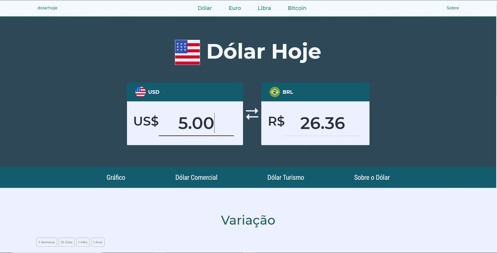

# Exchange

 🖥 Aplicação web para conversão de taxas de câmbio entre moedas estrangeiras em relação ao Real. 

### ⚙️ Estrutura

- Client w/ React, Exchange Rate API, Chart.js ✔️
- Firebase Hosting ✔️
 
### 🛠 Tecnologias
- [React](https://pt-br.reactjs.org/)
- [React Bootstrap](https://react-bootstrap.github.io/)
- [Exchange Rate API](https://exchangeratesapi.io/)
- [Chart.js](https://www.chartjs.org/)
- [Axios](https://axios-http.com/)
- [Firebase Hosting](https://firebase.google.com/docs/hosting)

### 🚀  https://dollar-exchange-be964.firebaseapp.com/

